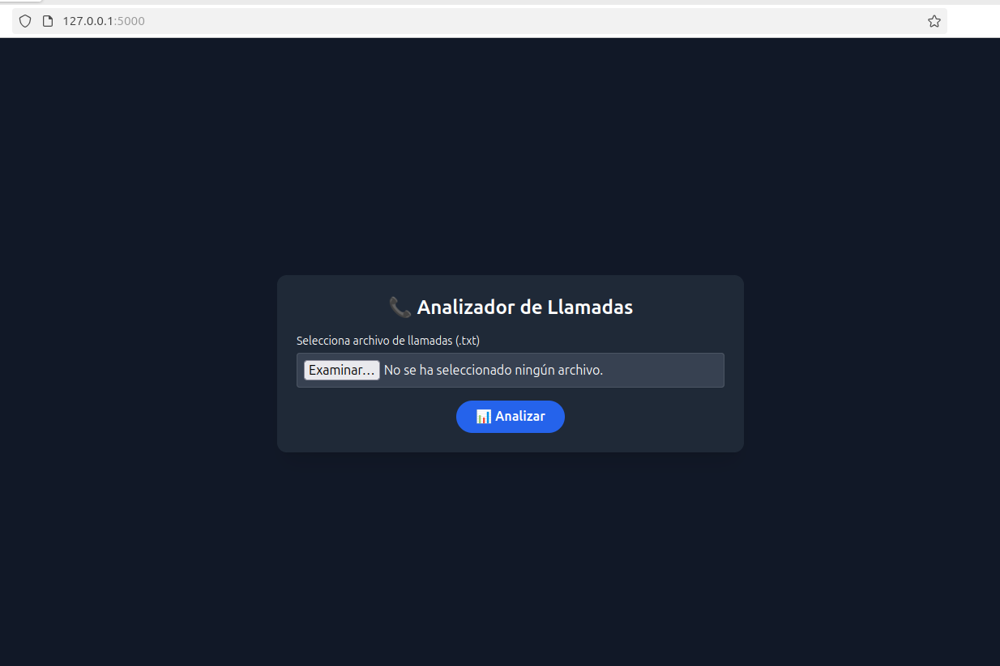
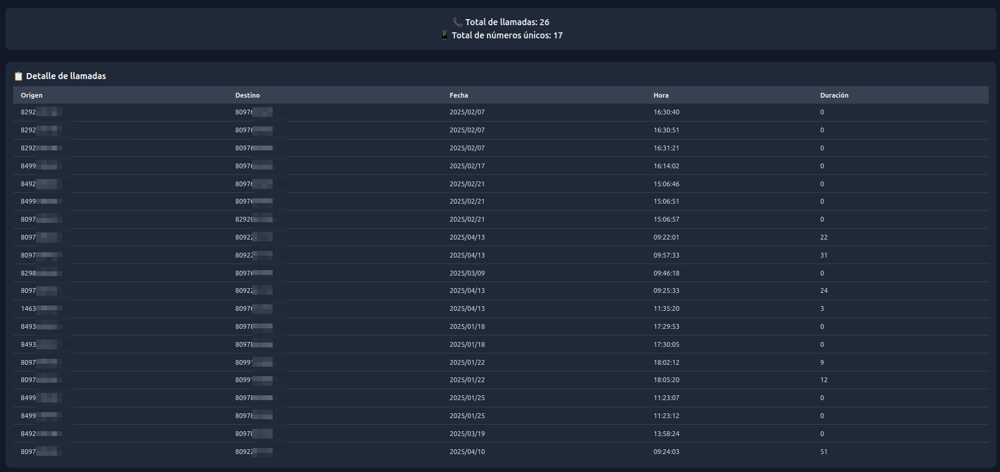
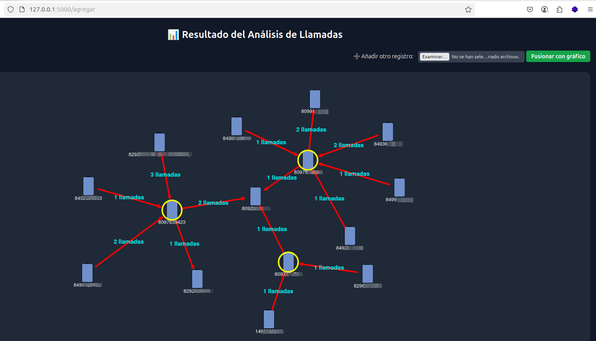

<p align="center">
  
</p>


<h1 align="center">📞 CallNodeX</h1>
<h3 align="center">Análisis visual de llamadas telefónicas</h3>

---

**CallNodeX** es una herramienta de análisis forense que permite visualizar registros de llamadas telefónicas desde archivos `.txt`, facilitando la detección de patrones, vínculos entre nodos y conexiones sospechosas. Ideal para unidades de investigación, inteligencia y cibercrimen.

---

## 🧠 Características principales

- 📁 Carga múltiples archivos `.txt` con registros de llamadas.
- 🔗 Visualización de llamadas como nodos y flechas interactivas.
- 🎯 Identificación de llamadas entrantes/salientes por color.
- 🏷️ Etiquetado y personalización de nodos con clic derecho.
- 🧩 Compatible con registros forenses y análisis de inteligencia.

---

## ⚙️ Requisitos

- Python 3.8 o superior
- pip

---

## 🚀 Instalación y uso local

```bash
# 1. Clona el repositorio
git clone https://github.com/k3nchy/CallNodeX.git
cd CallNodeX

# 2. (Opcional) Crea un entorno virtual
python3 -m venv venv
source venv/bin/activate  # En Windows: venv\Scripts\activate

# 3. Instala dependencias
pip install -r requirements.txt

# 4. Ejecuta la aplicación
python app.py
```

Luego accede desde tu navegador a:  
👉 `http://localhost:5000`

---

## 📄 Estructura de archivos esperada

El sistema espera archivos `.txt` con este formato:

```
emisor,receptor,fecha,hora,duración
8095551111,8095552222,2024-05-01,14:33,00:02:15
```

---

## 👤 Autor

Desarrollado por **k3nchy**  
🔎 Proyecto de análisis forense y visualización de llamadas telefónicas.

---

## 🛡️ Licencia

Uso educativo, investigativo y legal. Se prohíbe su uso para actividades ilícitas. El autor no se hace responsable del mal uso de esta herramienta.

---

## 📸 Capturas de pantalla

### 🟢 Interfaz de inicio


---

### 📋 Tabla de llamadas cargadas


---

### 🧠 Visualización del grafo de llamadas


